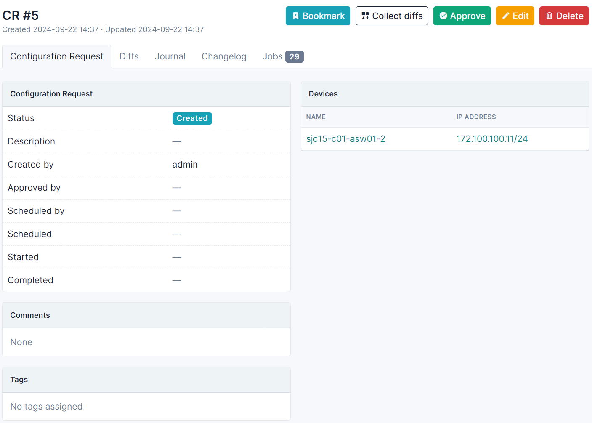
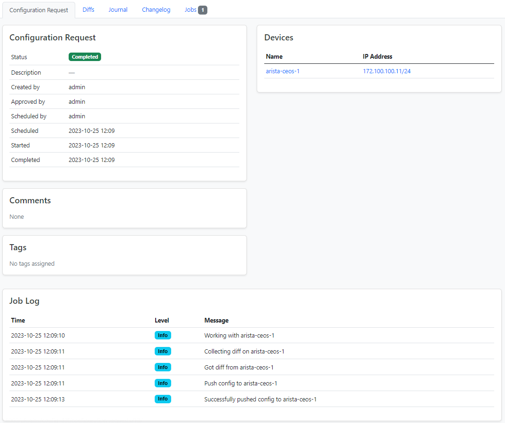

[](https://github.com/netbox-community/netbox)
[](https://pypi.org/project/netbox-config-diff/)
[](https://badge.fury.io/py/netbox-config-diff)
[](https://github.com/astral-sh/ruff)
[](https://opensource.org/licenses/Apache-2.0)
[](https://github.com/miaow2/netbox-config-diff/actions)

# NetBox Config Diff Plugin

[NetBox](https://github.com/netbox-community/netbox) plugin for Config Diff.

* Free software: Apache-2.0
* Documentation: https://miaow2.github.io/netbox-config-diff/

<!--about-start-->
## About

### Collecting diffs

With this plugin you can find diff between the rendered configuration for a device to its actual configuration, retrieved from the device itself, or stored in DataSource.
Read about [DataSources](https://demo.netbox.dev/static/docs/models/core/datasource/) for further details.

Device configuration renders natively in NetBox. This [feature](https://demo.netbox.dev/static/docs/features/configuration-rendering/) was introduced in 3.5 version.
 NetBox Labs [blog](https://netboxlabs.com/blog/how-to-generate-device-configurations-with-netbox/) post about it.

Plugin supports a wide list of vendors (Cisco, Juniper, Huawei, MicroTik etc.) with the help of Scrapli. Read [Scrapli](https://carlmontanari.github.io/scrapli/user_guide/project_details/#supported-platforms) and [scrapli-community](https://scrapli.github.io/scrapli_community/user_guide/project_details/#supported-platforms) documentations to find full list of vendors.

### Pushing configuration

Also you can push rendered configuration from NetBox to device and apply it.

Supported platforms:

* `arista_eos`
* `cisco_iosxe`
* `cisco_iosxr`
* `cisco_nxos`
* `juniper_junos`

This is possible thanks to the scrapli_cfg. Read [Scrapli](https://github.com/scrapli/scrapli_cfg/) documentation for more info.
<!--about-end-->

## Compatibility

| NetBox Version | Plugin Version |
|----------------|----------------|
|    3.5, 3.6    |    =>0.1.0     |

<!--install-start-->
## Installing

For adding to a NetBox Docker setup see
[the general instructions for using netbox-docker with plugins](https://github.com/netbox-community/netbox-docker/wiki/Using-Netbox-Plugins).

Install with pip:

```bash
pip install netbox-config-diff
```

Add to `local_requirements.txt`:

```bash
echo netbox-config-diff >> local_requirements.txt
```

Enable the plugin in `/opt/netbox/netbox/netbox/configuration.py`,
 or if you use netbox-docker, your `/configuration/plugins.py` file,
 and define credentials for devices connection:

```python
PLUGINS = [
    "netbox_config_diff",
]

PLUGINS_CONFIG = {
    "netbox_config_diff": {
        "USERNAME": "foo",
        "PASSWORD": "bar",
        "AUTH_SECONDARY": "foobar",  # define here password for accessing Privileged EXEC mode, this variable is optional
    },
}
```

Run database migrations:

```bash
python manage.py migrate

```
Collect static from the plugin:

```bash
python manage.py collectstatic --noinput
```

Restart NetBox service:

```bash
systemctl restart netbox netbox-rq
```
<!--install-end-->
<!--usage-start-->
## Usage

Read this [doc](https://miaow2.github.io/netbox-config-diff/colliecting-diffs/) about collecting diffs, for configuration management read [this](https://miaow2.github.io/netbox-config-diff/configuratiom-management/)

## Video

My presention about plugin at October NetBox community call (19.10.2023).

[](https://youtu.be/B4uhtYh278o?t=425)
<!--usage-end-->

## Screenshots

Compliance finished with error


Render diff between configurations


No diff


Configuration request



Completed Configuration request



## Credits

Based on the NetBox plugin tutorial:

- [demo repository](https://github.com/netbox-community/netbox-plugin-demo)
- [tutorial](https://github.com/netbox-community/netbox-plugin-tutorial)

This package was created with [Cookiecutter](https://github.com/audreyr/cookiecutter) and the [`netbox-community/cookiecutter-netbox-plugin`](https://github.com/netbox-community/cookiecutter-netbox-plugin) project template.
