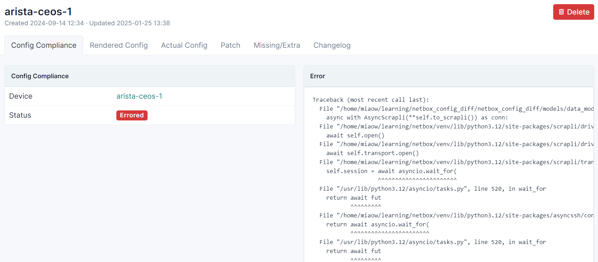

# NetBox Config Diff Plugin

NetBox plugin for Config Diff.

* Free software: Apache-2.0
* Documentation: https://miaow2.github.io/netbox-config-diff/

<!--about-start-->
## About

With this plugin you can find diff between the rendered configuration for a device to its actual configuration, retrieved from the device itself, or stored in DataSource.
Read about [DataSources](https://demo.netbox.dev/static/docs/models/core/datasource/) for further details.

Device configuration renders natively in NetBox. This [feature](https://demo.netbox.dev/static/docs/features/configuration-rendering/) was introduced in 3.5 version.
 NetBox Labs [blog](https://demo.netbox.dev/static/docs/features/configuration-rendering/) post about it.

Plugin supports a wide list of vendors (Cisco, Juniper, Huawei, MicroTik etc.) with the help of Scrapli. Read [Scrapli](https://github.com/carlmontanari/scrapli/tree/main/scrapli/driver/core) and [scrapli-community](https://github.com/scrapli/scrapli_community/tree/main/scrapli_community) documentations to find full list of vendors.
<!--about-end-->

## Compatibility

| NetBox Version | Plugin Version |
|----------------|----------------|
|     3.5        |    =>0.1.0     |

<!--install-start-->
## Installing

For adding to a NetBox Docker setup see
[the general instructions for using netbox-docker with plugins](https://github.com/netbox-community/netbox-docker/wiki/Using-Netbox-Plugins).

Install with pip:

```bash
pip install netbox-config-diff
```

Enable the plugin in `/opt/netbox/netbox/netbox/configuration.py`,
 or if you use netbox-docker, your `/configuration/plugins.py` file,
 and define credentials for devices connection:

```python
PLUGINS = [
    "netbox_config_diff",
]

PLUGINS_CONFIG = {
    "netbox_config_diff": {
        "USERNAME": "foo",
        "PASSWORD": "bar",
    },
}
```

Run database migrations:

```bash
python manage.py migrate

```
Collect static from the plugin:

```bash
python manage.py collectstatic --noinput
```

Restart NetBox service:

```bash
systemctl restart netbox
```
<!--install-end-->

## Usage

Read the [docs](https://miaow2.github.io/netbox-config-diff/usage) about how to use plugin.

## Screenshots

Compliance finished with error



Render diff between configurations


No diff


## Credits

Based on the NetBox plugin tutorial:

- [demo repository](https://github.com/netbox-community/netbox-plugin-demo)
- [tutorial](https://github.com/netbox-community/netbox-plugin-tutorial)

This package was created with [Cookiecutter](https://github.com/audreyr/cookiecutter) and the [`netbox-community/cookiecutter-netbox-plugin`](https://github.com/netbox-community/cookiecutter-netbox-plugin) project template.
