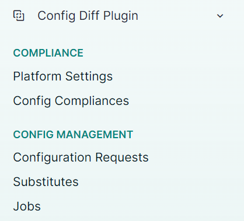

# NetBox Config Diff Plugin

NetBox plugin for Config Diff.


* Free software: Apache-2.0
* Documentation: https://miaow2.github.io/netbox-config-diff/

## Features

Find diff between configurations rendered in NetBox and actual on the device.

## Compatibility

| NetBox Version | Plugin Version |
|----------------|----------------|
|     3.5        |      0.1.0     |

## Installing

For adding to a NetBox Docker setup see
[the general instructions for using netbox-docker with plugins](https://github.com/netbox-community/netbox-docker/wiki/Using-Netbox-Plugins).

While this is still in development and not yet on pypi you can install with pip:

```bash
pip install git+https://github.com/miaow2/netbox-config-diff
```

or by adding to your `local_requirements.txt` or `plugin_requirements.txt` (netbox-docker):

```bash
git+https://github.com/miaow2/netbox-config-diff
```

Enable the plugin in `/opt/netbox/netbox/netbox/configuration.py`,
 or if you use netbox-docker, your `/configuration/plugins.py` file,
 and define credentials for devices connection:

```python
PLUGINS = [
    "netbox_config_diff",
]

PLUGINS_CONFIG = {
    "netbox_config_diff": {
        "USERNAME": "foo",
        "PASSWORD": "bar",
    },
}
```

Collect static from the plugin:

```bash
python manage.py collectstatic --noinput
```

## Usage

Under `Plugins` navbar menu you can find plugin



Add PlatformSetting objects for your platforms in NetBox.

Define:

- **Driver** for Scrapli, you can find all drivers in [Scrapli](https://github.com/carlmontanari/scrapli) and [Scrapli community](https://github.com/scrapli/scrapli_community) documentation.
- **Command** to collect configuration
- Optional regex patterns to exclude from actual config, specify each pattern on a new line


Plugin adds a custom script `ConfigDiffScript`


In the script, you can define a site, on which devices run compliance, or devices.
 If you define both fields, script will run only on devices from `Devices` field

> **Warning**
>
> Script run only on devices with status `Active`, assigned Primary IP, Platform and PlatformSetting


After script is done you can find results in `Config Compliances` menu. Each device has its own result.


## Examples

Compliance finished with error


Render diff between configurations


No diff


## Credits

Based on the NetBox plugin tutorial:

- [demo repository](https://github.com/netbox-community/netbox-plugin-demo)
- [tutorial](https://github.com/netbox-community/netbox-plugin-tutorial)

This package was created with [Cookiecutter](https://github.com/audreyr/cookiecutter) and the [`netbox-community/cookiecutter-netbox-plugin`](https://github.com/netbox-community/cookiecutter-netbox-plugin) project template.
