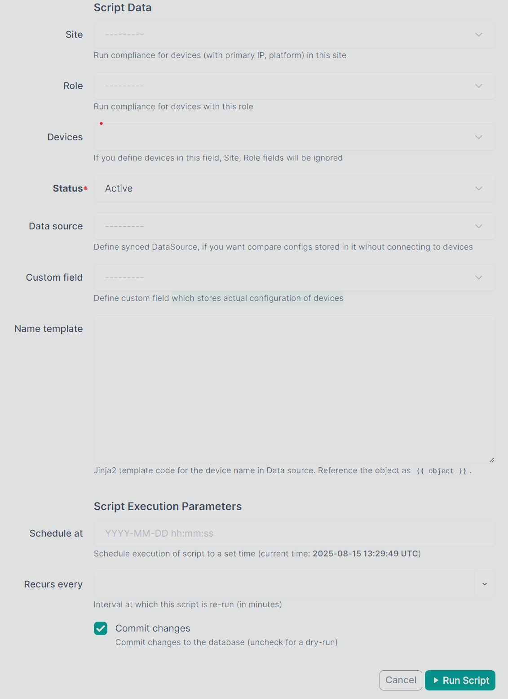

# Usage

Under `Plugins` navbar menu you can find plugin

## PlatformSetting

Add PlatformSetting objects for your platforms in NetBox. This model contains info about how to connect and what to collect from device.

Define:

- **Driver** for Scrapli, you can find all drivers in [Scrapli](https://github.com/carlmontanari/scrapli) and [Scrapli community](https://github.com/scrapli/scrapli_community) documentation.
- **Command** to collect configuration
- Optional regex patterns to exclude from actual config, specify each pattern on a new line

With regexps you can exclude big parts of the configuration and compare tiny configuration pieces (only ntp configuration).

You can test regexp on the site [regex101.com](https://regex101.com/).

## Script

Plugin adds a custom script `ConfigDiffScript` that runs all logic about diff calculations and connections to devices.
You can find scripts list in navbar `Customization -> Scripts`.

In the script, you can define a site, on which devices run compliance, or devices.
 If you define both fields, script will run only on devices from `Devices` field

!!! warning
    Script runs only on devices with assigned Primary IP, Config Template, Platform and PlatformSetting

If you have configs in NetBox DataSource, you can define it, the script instead of connecting to devices will find configs in DataSource by device's names.

!!! warning
    Be sure that DataSource is synced and has the latest data

!!! note
    Only synced DataSources are acceptable

## Results

After script is done you can find results in `Config Compliances` menu. Each device has its own result.

Also result is storing rendered and actual configurations from devices.

With the help of [netutils](https://github.com/networktocode/netutils) library plugin stores missing and extra config lines.

Supported platforms for missing/extra lines:

* Arista EOS (arista_eos)
* Aruba AOSCX (aruba_aoscx)
* Cisco AireOS (cisco_aireos)
* Cisco ASA (cisco_asa)
* Cisco IOS-XE (cisco_iosxe)
* Cisco IOS-XR (cisco_iosxr)
* Cisco NX-OS (cisco_nxos)
* Juniper JunOS (juniper_junos)
* Mikrotik RouterOS (mikrotik_routeros)
* Nokia SROS (nokia_sros)
* PaloAlto PanOS (paloalto_panos)
* Ruckus FastIron (ruckus_fastiron)

Compliance finished with error

Render diff between configurations

No diff

