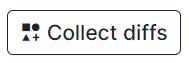
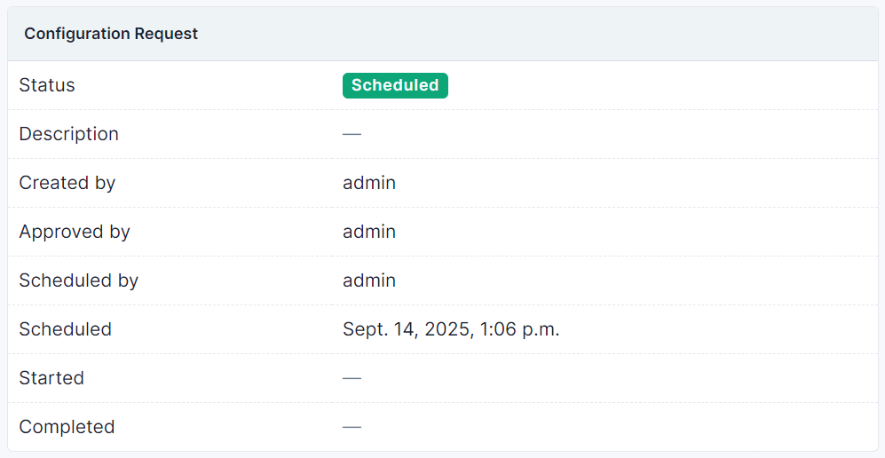

# Usage

With plugin you can push rendered configuration from NetBox to devices.

Supported platforms:

* `arista_eos`
* `cisco_iosxe`
* `cisco_iosxr`
* `cisco_nxos`
* `juniper_junos`

Plugin using [scrapli-cfg](https://github.com/scrapli/scrapli_cfg) for this feature.

## Substitutes

If you render not full configuration, it is acceptable to pull missing config sections from the actual configuration to render full configuration.

!!! note
    If you render full configuration in NetBox, you can proceed to `Configuration Request` part

To do that you should create substitute.

Substitutes is a "tag" that needs to be replaced with output from the real device, and a regex pattern that "pulls" this section from the actual device itself.


In screenshot below we add substitute for Arista PlatformSetting

* **Name** is a "tag", you should put this as jinja2 variable in your config template in NetBox
* **Regexp** is a regex, that "pulls" what matched from device and replace `Name` jinja2 variable in config template

In example substitute `ethernet_interfaces` section will be replaced with whatever the provided pattern finds from the real device.

This pattern matches all ethernet interfaces on a Arista device.

To correctly render substitute in config template you have two options:

```
{{ "{{ ethernet_interfaces }}" }}
```

or

```
{{ ethernet_interfaces }}
```

Config template will look like:


And rendered config template with substitute


## Configuration Request

Now you let's create `Configuration Request` with devices you want to configure.

!!! warning
    For request only accepts devices with `Active` status and assigned Platform, Primary IP, Config Template and PlatformSetting

Find `Configuration Requests` in navbar.

Now collect diffs for devices pressing `Collecting diffs` button.



On tab `Diffs` you can review diffs for devices.


To continue approve request by pressing `Approve` button.


Also you can cancel approve after that.


After approval you can see by whom configuration request is approved.


At this moment you can schedule job that will push rendered configuration to devices in configuration request by pressing schedule button.


After that you can see by whom configuration request is scheduled and time.



Also you can cancel scheduled job by pressing `Unschedule` button.


!!! warning
    Approve and Schedule buttons is accessable only to user with `netbox_config_diff.approve_configurationrequest`
    permission

!!! warning
    If you unapprove scheduled configuration request, scheduled job will be canceled

After scheduled job is completed you can job logs on configuration request page.


!!! note
    Completed configuration requests can't be edited.

## Rollback

If an error occurs while executing a job that pushes configurations to devices then all configured devices will be rollbacked to the previous version of the configuration.
